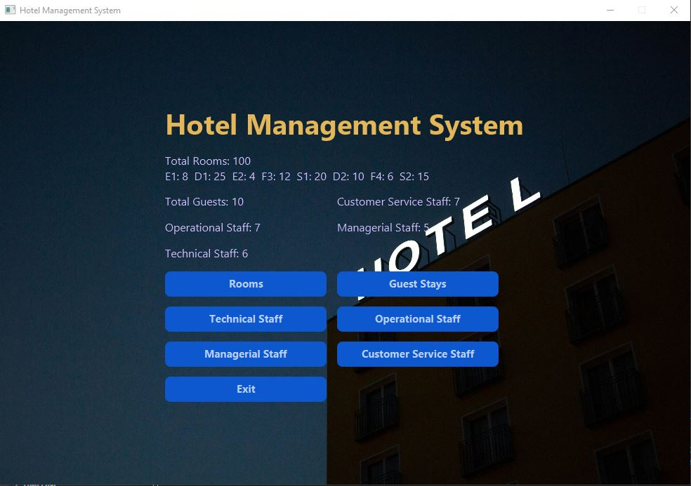
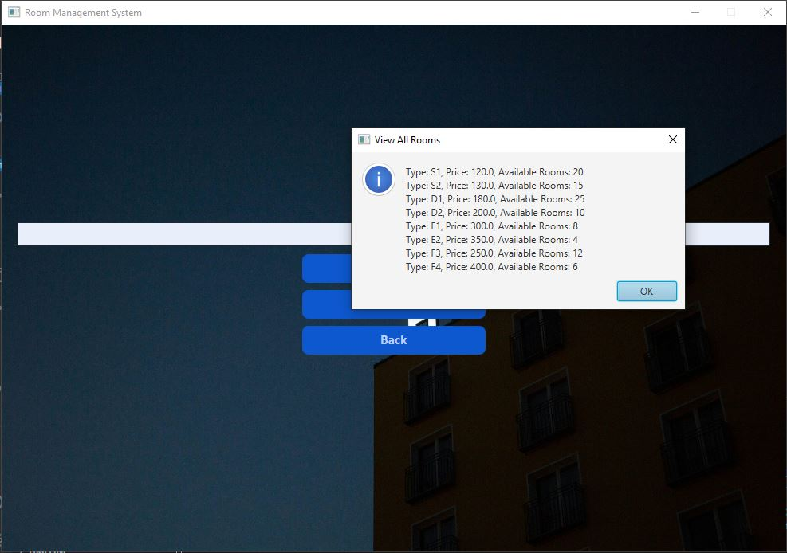
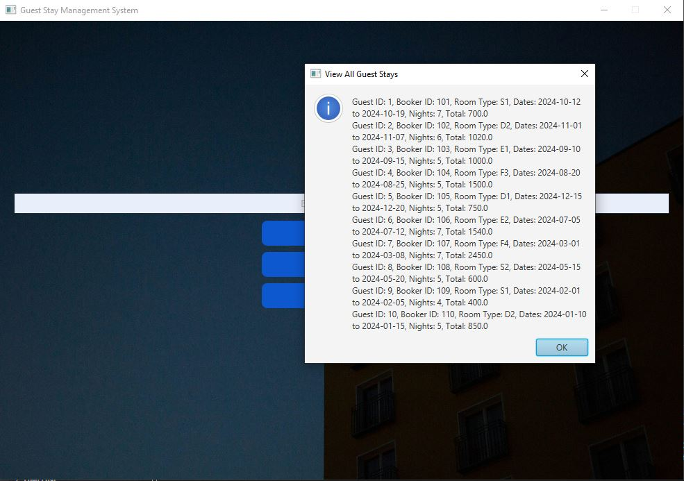
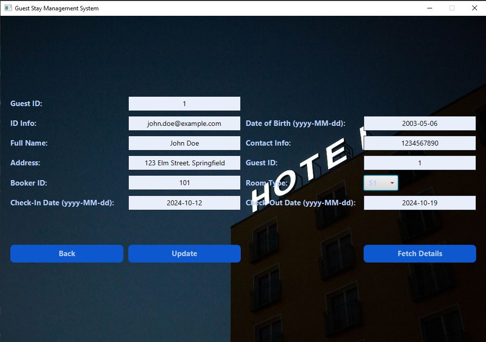
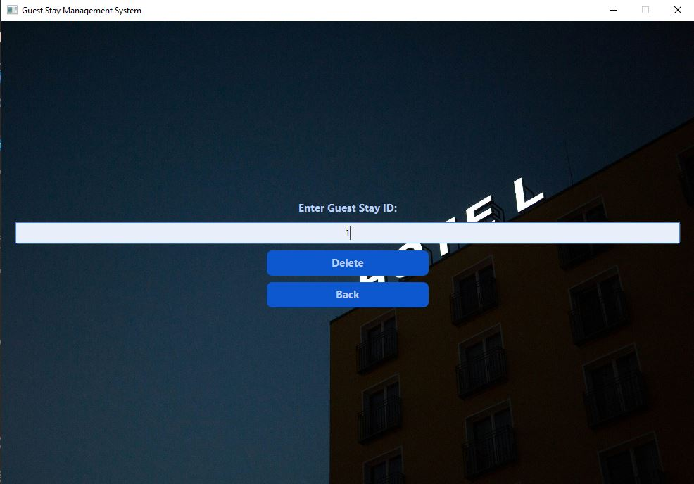
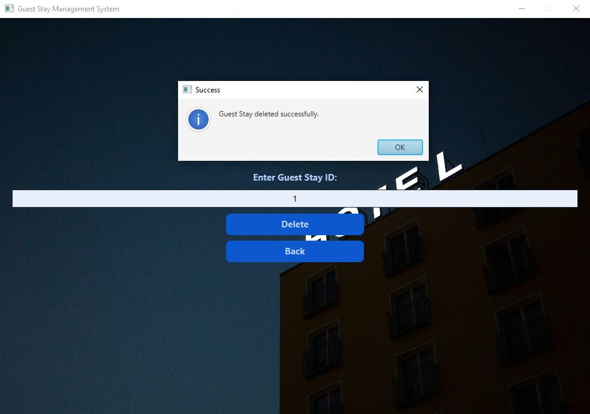
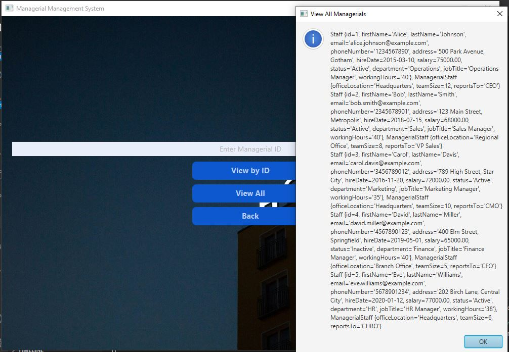
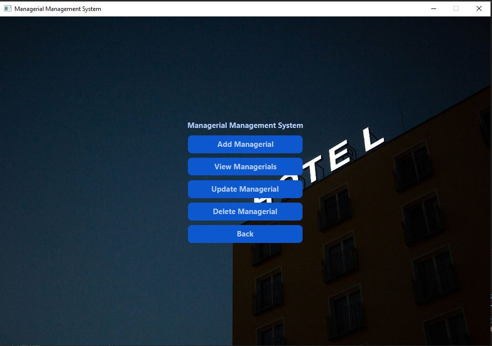
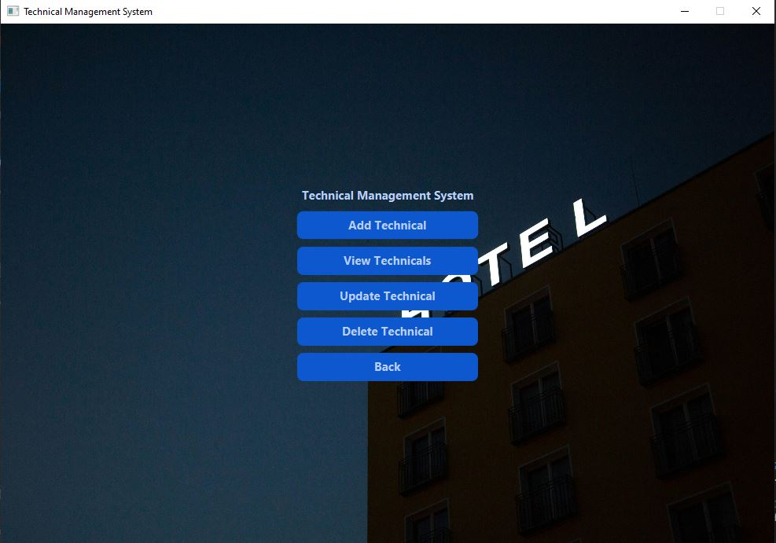
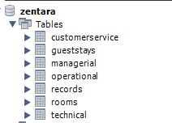

# Hotel Management System - Java Desktop Application

##  About

This Java desktop application simplifies hotel management by offering key features such as:

-  Staff and room management  
-  Booking operations  
-  Real-time availability checks

It provides a user-friendly admin interface using **JavaFX** and ensures robust database operations through **MySQL Workbench** integration.

##  Features

- **JavaFX UI**: Intuitive and responsive desktop interface for administrators  
- **Room Management**: Add, update, and remove room details  
- **Staff Management**: Manage hotel staff efficiently  
- **Booking System**: Handle reservations with real-time status updates  
- **Database Integration**: Seamless connection with MySQL for persistent data storage

##  Tech Stack

- **Java**  
- **JavaFX**  
- **MySQL Workbench**  
- **JDBC**

##  Getting Started

### Prerequisites

- Java JDK 8 or higher  
- MySQL Workbench & MySQL Server  
- JavaFX SDK  
- IDE (e.g., IntelliJ IDEA, Eclipse)

### Setup

1. Clone the repository:
    git clone https://github.com/HMotez/HotelSystem.git

## Screenshots and Interface
Below are placeholders for screenshots depicting various functionalities of the application. You can add the source of each image manually.
<table> <tr> <td></td> <td></td> <td></td> </tr> <tr> <td></td> <td></td> <td></td> </tr> <tr> <td></td> <td></td> <td></td> </tr> <tr> <td></td> <td></td> <td></td> </tr> </table> ```
